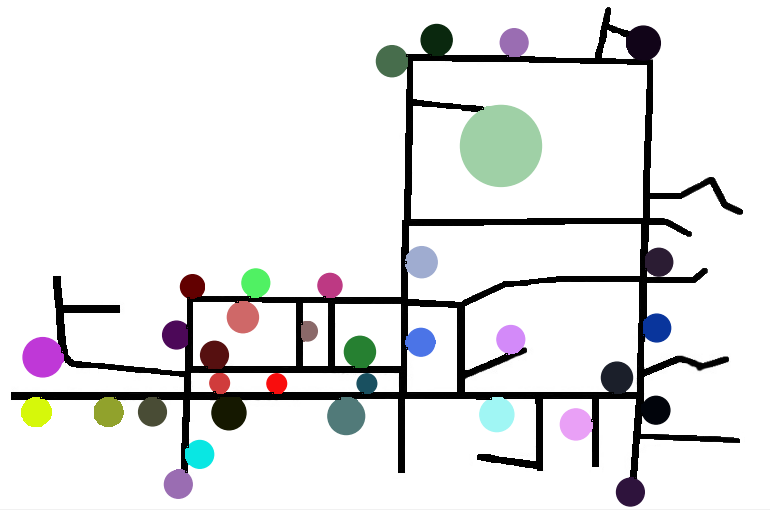
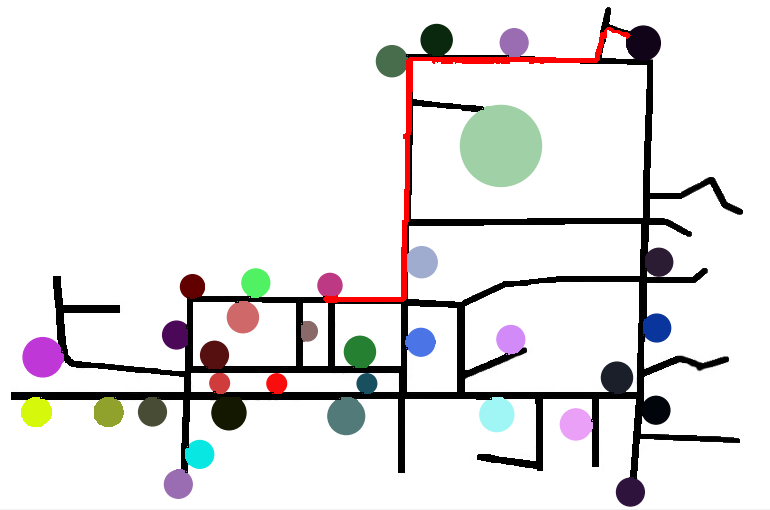

# Mapping system for Organizations

It is often confusing for new visitors in an organization to locate various blocks of the organization. Hence navigation at such locations becomes problematic. The main idea of this project is to provide a **Mapping System for Organizations** so that the visitors get a GUI where they can find the different blocks in the organization and navigate to the desired location. The aim is to show the user the shortest possible path to get to the desired location. This is achieved using the _A\* Search algorithm_.

## About the Project

- The task is to help users with navigation inside an organization.
- Once the destination is selected, the shortest path to the destination is highlighted in the map of the organization.
- A\* Search algorithm is used to find the shortest path between the two points.
- The GUI helps the user to interact with the program. The resultant map is presented to the user in the GUI itself.

## Requirements

- `Python 3`
- `Numpy`
- `pillow`
- `tkinter`

## File description

- [`astar.py`](astar.py) runs the search algorithm.
- [`gui.py`](gui.py) GUI for interaction.

## Description

### About the A\* Search Algorithm

A\* Search Algorithm is one of the best and popular technique used in path-finding and graph traversals. Unlike Dijkstra’s algorithm, A\* search algorithm is much more efficient as it also considers its current position from the end node while traversal. It’s not a brute force method but it has an approach which makes it traverse on only the paths that lead to the end node making it efficient.
 
What A\* search algorithm does is that at each step during traversal it calculates a certain parameter, known as the _f-score_ – _f(n)_. This f-score is the sum of two other parameters namely _g-score_ and _h-score_. At each step it picks up the node/neighbour that has the least f-score.
 
_g-score_ – [g(n)] is defined as the movement cost to move from the start node to the nth node following the path it took to get to the nth node.
 
_h-score_ – [h(n)] is defined as the estimated distance of the nth node from the end node. It is called the heuristic function. This is not an exact distance like the g-score but something like a smart guess. There a various ways to find the h-score – _Manhattan_ distance, _Diagonal_ distance and the _Euclidean_ distance.
 
Therefore the _f-score_ is defined as: _f(n) = g(n) + h(n)_

### Implementation

The basic idea behind the project is to use the A\* search algorithm to ease navigation in an organization/institution. The approach is to present a map of the organization to the user wherein the user is prompted to choose his/her current location and his/her destination. Once that is done, the algorithm runs in the background and finds the shortest path between the given two locations. If the algorithm finds the shortest path, then the map is highlighted with the shortest path and the final map is presented to the user.

For _navigation_ we need to extract the map of the organization and collect data about all the important blocks in the organization. The map is extracted from Google Maps. First the roads (paths) on the map are extracted and then the various blocks of the institute/organization are marked on the map. Every location on the map is marked with a unique color which helps in identifying every block. 
This _updated map_ as an image (or a grid) is given as an input to the algorithm. The _start_ and the _end_ nodes are provided to the algorithm. The algorithms runs, finds the shortest path and re-draws the _found_ path on the map and outputs the image to the user.

## Output

_Note: This project works only one organization (SJCE Mysore) as of now, but we wish to develop a better and automated system for the same._  

#### The map of SJCE: 

 

#### Obtained output: 

